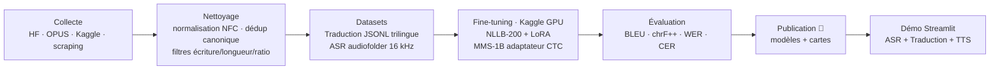

# Ewe NLP Toolkit — Traduction · ASR · TTS pour une langue peu dotée

Pipeline **de bout en bout** (collecte → nettoyage → fine-tuning → évaluation →
publication → démo) pour le traitement automatique de l'**éwé** (`ee` / `ewe_Latn`),
une langue Gbe parlée au **Togo** et au **Ghana**, considérée comme _low-resource_.

Le projet fine-tune des modèles massifs multilingues (Meta **NLLB-200** et **MMS**)
pour trois tâches : **traduction** (éwé ⇄ anglais ⇄ français), **reconnaissance
vocale** (ASR) et **synthèse vocale** (TTS), puis les expose dans une **application
de démonstration**.

> Projet académique — M1 Intelligence Artificielle, École Polytechnique de Lomé (INF2229).

---

## ✨ Modèles publiés (Hugging Face)

| Modèle                               | Tâche                       | Base                               | Licence      | Lien                                                                         |
| ------------------------------------ | --------------------------- | ---------------------------------- | ------------ | ---------------------------------------------------------------------------- |
| **mms-ewe-asr-mixed**                | ASR éwé (voix → texte)      | `facebook/mms-1b-all`              | CC-BY-NC-4.0 | [🤗](https://huggingface.co/romaricnadjire/mms-ewe-asr-mixed)                |
| **nllb-ewe-en-fr-multilingual-lora** | Traduction éwé⇄en⇄fr (LoRA) | `facebook/nllb-200-distilled-600M` | CC-BY-NC-4.0 | [🤗](https://huggingface.co/romaricnadjire/nllb-ewe-en-fr-multilingual-lora) |

### Résultats — Traduction (BLEU / chrF++, test)

| Direction |    BLEU ↑ | chrF++ ↑ |    n |
| --------- | --------: | -------: | ---: |
| ewe → eng | **26.16** |    44.88 | 4336 |
| eng → ewe | **23.29** |    43.18 | 4340 |
| eng → fra |     41.55 |    56.43 | 1988 |
| fra → eng |     46.39 |    65.45 | 1988 |
| ewe → fra |      6.27 |    24.61 | 2362 |
| fra → ewe |      4.12 |    29.09 | 2363 |

> L'éwé↔anglais est exploitable ; l'éwé↔français reste **faible** (peu de parallèle
> français↔éwé disponible) — piste d'amélioration identifiée.

### Résultats — ASR (validation, jeu mixte multi-domaines)

| Modèle                                |       WER ↓ |      CER ↓ |
| ------------------------------------- | ----------: | ---------: |
| Base `mms-1b-all` (avant fine-tuning) |    100.00 % |   236.73 % |
| **mms-ewe-asr-mixed (fine-tuné)**     | **29.19 %** | **6.82 %** |

---

## 🧭 Pipeline



**Traitements clés des données** :

- Agrégation de sources hétérogènes (Bible, presse, navigation, littéraire, DUDH…).
- **Déduplication canonique** (clé indépendante de l'ordre des langues) pour éliminer
  les doublons inverses.
- Filtrage des corpus **minés** par score de similarité ; filtres écriture étrangère,
  ratio de longueur, copies source=cible.
- **Anti-fuite** : exclusion stricte des paires présentes en validation/test.
- ASR : rééchantillonnage **16 kHz**, format `audiofolder` + `metadata.jsonl`.

---

## 📁 Structure

```
src/            Code du pipeline
  download/       collecte (Hugging Face, OPUS, Kaggle)
  scraping/       scraping de sources libres (peterlin, Wikipédia)
  prepare/        nettoyage · fusion · déduplication · manifestes
  push/           publication des modèles / datasets sur le Hub
notebooks/      Fine-tuning & inférence (asr/ · translation/ · exploration/)
app/            Application de démonstration Streamlit (ASR + MT + TTS)
model_cards/    Fiches des modèles publiés (licence + attributions)
data/CATALOG.md Catalogue des sources : langues, licences, statuts (données NON versionnées)
docs/           Procédures et guides
results/        Courbes d'entraînement
kaggle/         Kernels & métadonnées Kaggle
```

> Les données brutes, les corpus minés et les poids exportés sont **volontairement
> exclus** du dépôt (voir `.gitignore` et `data/CATALOG.md`).

---

## 🚀 Démarrage rapide

```bash
python3 -m venv .venv && source .venv/bin/activate
pip install -r requirements.txt
```

### Traduction (éwé → français)

```python
from transformers import AutoModelForSeq2SeqLM, AutoTokenizer
from peft import PeftModel

BASE, ADAPTER = "facebook/nllb-200-distilled-600M", "romaricnadjire/nllb-ewe-en-fr-multilingual-lora"
CODE = {"ee": "ewe_Latn", "en": "eng_Latn", "fr": "fra_Latn"}
tok = AutoTokenizer.from_pretrained(BASE)
model = PeftModel.from_pretrained(AutoModelForSeq2SeqLM.from_pretrained(BASE), ADAPTER).eval()

tok.src_lang = CODE["ee"]
ids = tok("Ŋdi na mi", return_tensors="pt")
out = model.generate(**ids, forced_bos_token_id=tok.convert_tokens_to_ids(CODE["fr"]), num_beams=4)
print(tok.batch_decode(out, skip_special_tokens=True)[0])
```

### Reconnaissance vocale (éwé)

```python
import torch, soundfile as sf
from transformers import AutoProcessor, Wav2Vec2ForCTC

proc = AutoProcessor.from_pretrained("romaricnadjire/mms-ewe-asr-mixed")
model = Wav2Vec2ForCTC.from_pretrained("romaricnadjire/mms-ewe-asr-mixed").eval()
audio, sr = sf.read("audio_16k.wav", dtype="float32")   # mono, 16 kHz
logits = model(proc(audio, sampling_rate=16000, return_tensors="pt").input_values).logits
print(proc.batch_decode(torch.argmax(logits, -1), skip_special_tokens=True)[0])
```

### Application de démonstration

```bash
pip install -r app/requirements.txt
streamlit run app/app.py
```

---

## ⚖️ Licences & attributions

- **Modèles** : `CC-BY-NC-4.0` (héritée des modèles de base Meta **MMS** et **NLLB-200**) —
  usage **non commercial**, attribution requise.
- **Code** : licence **MIT** (voir [LICENSE](LICENSE)).
- **Données** : **non redistribuées** ici ; chaque source conserve sa licence propre
  (BibleTTS CC-BY-SA 4.0, OPUS _bible-uedin_ domaine public, GhanaNLP CC-BY 4.0…).
  Détails dans [NOTICE.md](NOTICE.md) et [data/CATALOG.md](data/CATALOG.md).

> ⚠️ Ceci n'est pas un avis juridique : vérifier les licences avant tout usage
> commercial ou toute rediffusion des jeux de données.

## 👤 Auteur

**Romaric Nadjire** — M1 Intelligence Artificielle, École Polytechnique de Lomé.
Modèles : [huggingface.co/romaricnadjire](https://huggingface.co/romaricnadjire).
